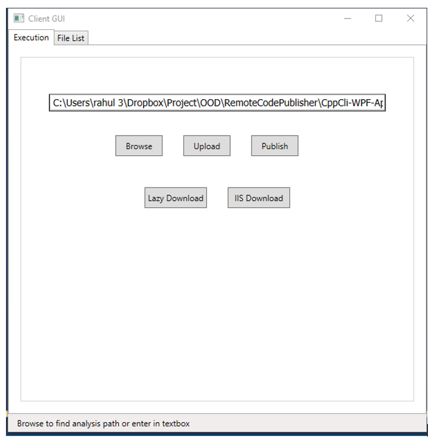
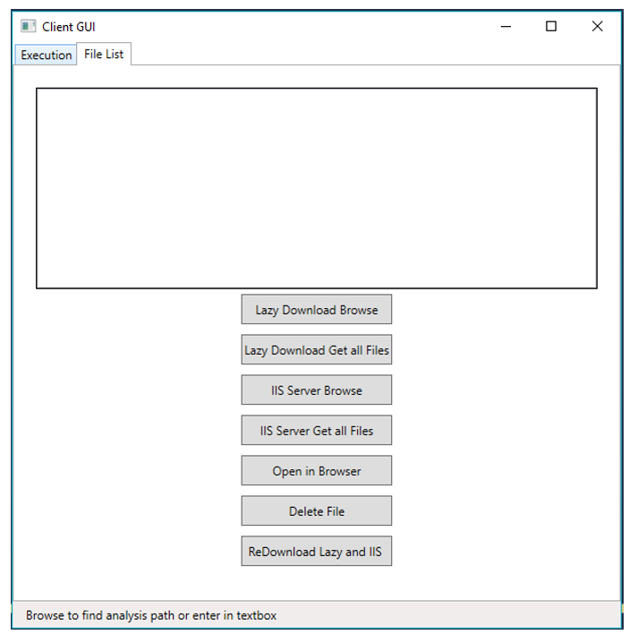
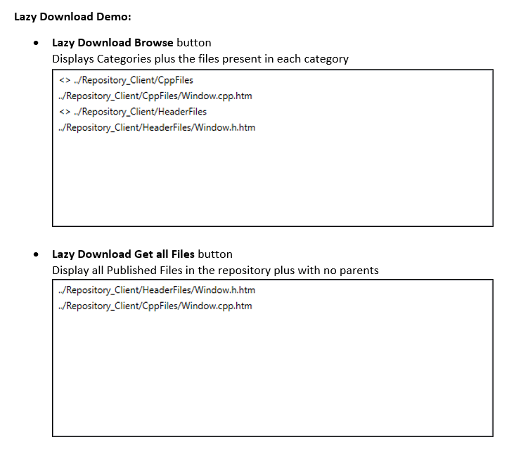
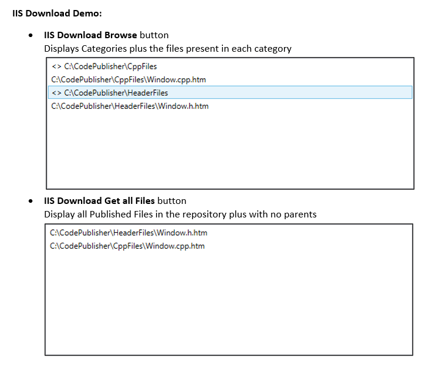

# Project 4 - RemoteCodePublisher

Project 4: http://www.ecs.syr.edu/faculty/fawcett/handouts/CSE687/Lectures/Project4-S2017.htm

#### Command line args:
start CppCli-WPF-App.exe localhost:8081 localhost:8080 C:\CodePublisher\

Client Details :  localhost:8081

Server Details : localhost:8080

Virtual Path: C:\CodePublisher\

#### Demonstration:

Note: Please create CodePublisher folder as per path “C:\CodePublisher\” for Demo purposes.

On loading the GUI, the javascript and css files will be downloaded in the virtual path folder provided at the command line args of the GUI - CppCli-WPF-App.exe

Eg: start CppCli-WPF-App.exe localhost:8081 localhost:8080 C:\CodePublisher\

Javascript , css and other utililies will be downloaded at “C:\CodePublisher\”.

#### Demo:

#### “Execution Tab”

•	Browse button 		

Selects Folder Path to be analyzed.

Eg:  ../ CppCli-WPF-App/  Path Selected in snippet above

•	Upload button 		

 Uploads all the .h and .cpp files present in folder selected above to path “../Repository_Server/”

•	Publish button 	

Publishes all the .h and .cpp files present in folder “../Repository_Server/” into folder

“../Repository_Code_Publish/” with the corresponding folders as “Categories”:

“../Repository_Code_Publish/CppFiles”  -> Category stores all html Cpp Files

“../Repository_Code_Publish/HeaderFiles”  -> Category stores all html Header Files
 
•	For Lazy Download:

Lazy Download button

Downloads Published html files from folder “../Repository_Code_Publish/” into folder “../Repository_Client/” with the corresponding folders as “Categories”:

“../Repository_Client/CppFiles”  -> Category stores all html Cpp Files

 “../Repository_Client/HeaderFiles”  -> Category stores all html Header Files

•	For IIS Download:

IIS Download button:

Downloads Published html files from folder “../Repository_Code_Publish/” into folder 

Virtual path mentioned in the command line args of GUI earlier.

Eg: “C:\CodePublisher\”with the corresponding folders as “Categories”:

“C:\CodePublisher\CppFiles\”  -> Category stores all html Cpp Files

 “C:\CodePublisher\HeaderFiles”  -> Category stores all html Header Files

#### “File List Tab”

Assuming ../ CppCli-WPF-App/  as folder selected earlier and Upload , Publish , Lazy Download and IIS Download buttons are used.

“Window.h” and “Window.cpp” files are uploaded and published to server plus downloaded to Client Repository (“../Repository_Client/”)
and IIS Repository (“C:\CodePublisher\”).

#### General Use Buttons:

•	Open in Browser Browse button 		

Opens selected files in Browser. Can be used for both Lazy Download and IIS Download Repositories.

•	Delete File button		

Deletes selected published files, plus also republishes the undeleted (remaining) files.

Can be used for both Lazy Download and IIS Download Repositories.

•	ReDownload Lazy and IIS button		

After Deleting and republishing above files we can Redownload current files in our Lazy and IIS Repositories using this button.
